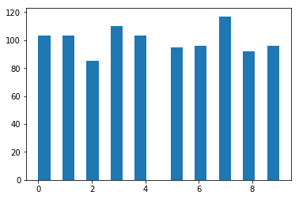
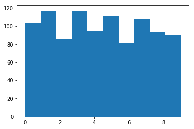
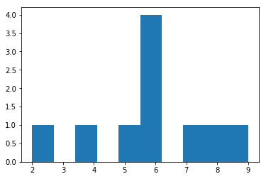
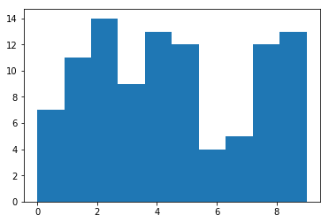
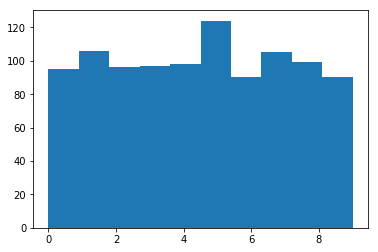
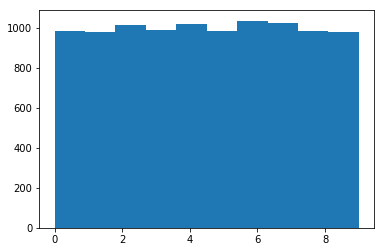

# Assignment 4

## Generating Random Numbers

### Problem Statement

Write and algorithm and code to generate a random sequence of numbers as follows:

Generate a sequence of numbers wherein each number has 10 digits which are chosen at random using any choice of probability distribution function. Once such a sequence is generated, choose one digit randomly from each number either using the same probability distribution function or a different one. Theoretically understand the concept, if such sequence generated is random or not. 


```python
import numpy as np
from scipy import stats 
import matplotlib.pyplot as plt
```

### Creating a sample from Discrete Uniform Distribution From 0 to 9


```python
np.random.seed(123)
r = np.random.randint(10, size=1000)
plt.hist(r,bins=20)
plt.show()
```





### Sampling from the Generated Distribution


```python
def randomnum(m,n): # 'm' is the number of 'n' digit numbers sampled
    a = np.zeros((m,n))
    for i in range(m):
        b = []
        for j in range(n):
            b.append(np.random.randint(10))
        a[i,:] = b
    #np.shape(a)
    x = []
    for i in range(m):
        x.append(a[i,np.random.randint(n)])
    return x
```


```python
#testing out the function
a=randomnum(1000,10)
np.shape(a)

```


    (1000,)


```python

```





    array([104., 116.,  86., 117.,  94., 111.,  81., 108.,  93.,  90.])


### Chi-Square Test

Is the sequence we generated random? We can’t make a definite yes/no statement, but we can give a probabilistic answer. We can form the Chi-Square Statistic.

$$D=\sum_{i=1}^k\frac{(o_i-e_i)^2}{e_i}$$

Where:
     $o_i$ is the observed frequency, which in our case are the frequencies corresponding to the bins(numbers from 1-10).

$e_i$ is the expected frequency based on our distribution (i.e. uniform distribution). In our case, this would be equally divided for all the bins, or $e_i = \frac{n}{10}$

$k$ is the degree of freedom, which is $n-1$ in our case.

In essence, to verify the random sequence generated, we must find the chi-square value corresponding to the hisogram we got and the expected values, which in the case of uniform distribution is the number of samples divided by the bins (10). We shall try to get the values for different values of n = (10,100,1000,10000).


```python
np.random.seed(53)
t = randomnum(10,10)
h = plt.hist(t,bins=10)
plt.show()
e = 10/10;
chisq = sum(pow(h[0]-e,2)/e)
p_value = 1-stats.chi2.cdf(chisq, 9)
p_value

#verifying from the in-built function
stats.distributions.chi2.sf(chisq,9)
```





    0.21330930508341653


According to the result of the Chi-Square test, for n=10, we can reject the null hypothesis that our random number generator generates uniform random numbers with only 21% confidence.

#### For n=100


```python
np.random.seed(90)
t = randomnum(100,10)
h = plt.hist(t,bins=10)
plt.show()
e = 100/10;
chisq = sum(pow(h[0]-e,2)/e)
p_value = 1-stats.chi2.cdf(chisq, 9)
p_value
```





    0.24928389397664907


According to the result of the Chi-Square test, for n=100, we can reject the null hypothesis that our random number generator generates uniform random numbers with only 24% confidence.

#### For n=1000


```python
np.random.seed(80)
t = randomnum(1000,10)
h = plt.hist(t,bins=10)
plt.show()
e = 1000/10;
chisq = sum(pow(h[0]-e,2)/e)
p_value = 1-stats.chi2.cdf(chisq, 9)
p_value
```





    0.4446914889170639


According to the result of the Chi-Square test, for n=1000, we can reject the null hypothesis that our random number generator generates uniform random numbers with only 44% confidence.

#### For n=10000


```python
np.random.seed(90)
t = randomnum(10000,10)
h = plt.hist(t,bins=10)
plt.show()
e = 10000/10;
chisq = sum(pow(h[0]-e,2)/e)
p_value = 1-stats.chi2.cdf(chisq, 9)
p_value
```





    0.9030630849199266


According to the result of the Chi-Square test, for n=10000, we can reject the null hypothesis that our random number generator generates uniform random numbers with only 90% confidence.

### Conclusion

We can conclude by saying, we cannot ever generate truely random numbers, nor can we comment on their absolute randomness. We use various tests to test only the given sequence in terms of their frequency. We used one such test, namely the chi-square test, only to observe that the confidence with which we can declare a sequence random increases with the number of samples (n).


```python

```
